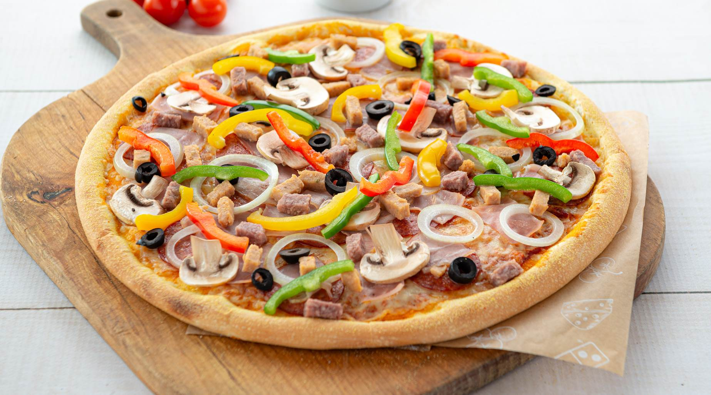

# MENU

## Pizze klasyczne

|LP. |Pizza: |rozmiar: | 30 cm | 50 cm | 60 cm |
|---|---------------------------------------|-----|----|-----|--------|
|1. |MARGARITA (sos pomidorowy, ser, oregano)| | 20 zł | 25 zł | 30 zł |
|2. |FUNGHI (sos pomidorowy, ser, pieczarki)| | 22 zł | 25 zł | 30 zł |
|3. |SALAMI (sos pomidorowy, ser, salami)| | 23 zł | 27 zł | 33 zł |
|4. |VEZUWIO (sos pomidorowy, podwujny ser, szynka)| | 25 zł | 28 zł | 36 zł | 
|5. |MILANO (sos pomidorowy, ser, papryka, oregano)| | 26 zł | 29 zł | 39 zł |

## Pizze zwinęte w pieróg

|LP. |Pizza: |rozmiar: | 30 cm | 50 cm | 60 cm |
|---|---------------------------------------|-----|----|-----|--------|
|1. |KEBAB (sos pomidorowy, sos czosnkowy, ser, oregano, kebab)| | 27 zł | 30 zł | 40 zł |
|2. |GRECKA (sos pomidorowy, ser, pieczarki)| | 22 zł | 25 zł | 30 zł |
|3. |SALAMI (sos pomidorowy, ser, salami)| | 23 zł | 27 zł | 33 zł |

## Makarony

|LP. |Pizza: |rozmiar: | 30 cm | 50 cm | 60 cm |
|---|---------------------------------------|-----|----|-----|--------|
|1. |BOLONOSE| | 27 zł | 30 zł | 40 zł |
|2. |CARBONARA| | 22 zł | 25 zł | 30 zł |
|3. |LASAGNE| | 23 zł | 27 zł | 33 zł |
